# Level Up Accounts - Infrastructure as Code

A production-ready, cloud-native infrastructure for the Level Up Accounts application, featuring automated secret management, comprehensive monitoring, and GitOps deployment practices.

## 🏗️ Architecture Overview

This repository deploys a complete Kubernetes infrastructure on AWS with enterprise-grade features:

### Core Components
- **🚀 Level Up Accounts API** - .NET Core application with dynamic configuration
- **📊 Monitoring Stack** - Prometheus, Grafana, Loki for observability
- **🔄 GitOps** - ArgoCD for automated application deployment
- **🔐 Secret Management** - External Secrets Operator with AWS Secrets Manager
- **🛡️ Security** - Cert-Manager with Let's Encrypt for automated TLS

## 🔄 Automated Secret Management Flow

```mermaid
graph TB
    subgraph "🚀 DEPLOYMENT FLOW (Correct Order)"
        A["Wave 0: External Secrets Operator<br/>apps/external-secrets-app.yaml"]
        B["Wave 1: External Secrets Config<br/>apps/external-secrets-config-app.yaml"]
        C["Wave 2: Level Up Accounts API<br/>apps/level-up-accounts/api-app.yaml"]
        
        A --> B --> C
    end
    
    subgraph "🔄 AUTOMATED SECRET FLOW"
        D["1. Terraform creates<br/>AWS Secrets Manager"]
        E["2. GitHub workflow stores<br/>token in AWS"]
        F["3. ESO fetches token<br/>from AWS"]
        G["4. ESO creates github-auth<br/>K8s secret"]
        H["5. API pod mounts<br/>secret automatically"]
        
        D --> E --> F --> G --> H
    end
    
    subgraph "🏗️ INFRASTRUCTURE COMPONENTS"
        I["☁️ AWS Secrets Manager<br/>level-up-accounts/github-token"]
        J["👤 IAM User<br/>level-up-accounts-external-secrets"]
        K["🔐 K8s Secret<br/>aws-credentials (workflow creates)"]
        L["🔐 K8s Secret<br/>github-auth (ESO creates)"]
        
        I -.-> L
        J -.-> K
        K -.-> L
    end
    
    style A fill:#e6ccff,stroke:#9900cc,color:#000000
    style B fill:#ccffcc,stroke:#00aa00,color:#000000
    style C fill:#cceeff,stroke:#0066cc,color:#000000
    style D fill:#fff0cc,stroke:#cc9900,color:#000000
    style E fill:#fff0cc,stroke:#cc9900,color:#000000
    style F fill:#ccffcc,stroke:#00aa00,color:#000000
    style G fill:#ccffcc,stroke:#00aa00,color:#000000
    style H fill:#e6f3ff,stroke:#0066cc,color:#000000
    style I fill:#ffeecc,stroke:#ff6600,color:#000000
    style J fill:#ffeecc,stroke:#ff6600,color:#000000
    style K fill:#ffccee,stroke:#cc0066,color:#000000
    style L fill:#ccffee,stroke:#00cc66,color:#000000
```



## 🎯 Key Features

### ✅ Automated Secret Management
- **No manual secret patching** - External Secrets Operator handles everything
- **Centralized storage** - Secrets managed in AWS Secrets Manager
- **Automatic rotation** - Secrets refresh every hour
- **GitOps compliant** - No secrets stored in Git

### 🔄 GitOps Deployment
- **ArgoCD App-of-Apps pattern** - Manages all applications declaratively
- **Ordered deployment** - Sync waves ensure proper dependency order
- **Self-healing** - Automatic drift detection and correction
- **Rollback capability** - Git-based deployment history

### 📊 Enterprise Monitoring
- **Prometheus** - Metrics collection and alerting
- **Grafana** - Pre-configured dashboards for Kubernetes and application metrics
- **Loki** - Centralized log aggregation and analysis
- **Cert-Manager** - Automated TLS certificate management

## 🛠️ Prerequisites

- **AWS Account** with appropriate permissions
- **Domain** managed in Route53 (thongit.space)
- **GitHub Repository** with secrets configured
- **Local Tools**:
  - Terraform >= 1.3.0
  - kubectl
  - AWS CLI

## 🚀 Quick Start

### 1. Configure GitHub Secrets
Add these secrets to your GitHub repository:

```bash
AWS_ACCESS_KEY_ID=your-aws-access-key
AWS_SECRET_ACCESS_KEY=your-aws-secret-key
GIT_TOKEN=your-github-token
ROUTE53_ZONE_ID=your-route53-zone-id
ACME_EMAIL=your-email@domain.com
# ... other required secrets
```

### 2. Deploy Infrastructure
```bash
# Run the complete deployment workflow
gh workflow run "Complete Infrastructure Deployment" \
  --ref main \
  -f deploy_terraform=true \
  -f deploy_nginx_ingress=true \
  -f deploy_cert_manager=true \
  -f deploy_app_of_apps=true
```

### 3. Access Services
After deployment completes (10-15 minutes):

- **ArgoCD**: https://argocd.thongit.space
- **Grafana**: https://grafana.thongit.space  
- **API**: https://api.thongit.space

## 📁 Repository Structure

```
├── apps/                          # ArgoCD Applications
│   ├── app-of-apps.yaml          # Root application
│   ├── external-secrets-app.yaml # External Secrets Operator
│   ├── external-secrets-config-app.yaml # ESO configuration
│   └── level-up-accounts/         # Main application
├── helm/                          # Helm configurations
│   ├── grafana/                   # Grafana dashboards & config
│   ├── prometheus/                # Prometheus configuration
│   └── cert-manager/              # TLS certificate configs
├── k8s/                          # Kubernetes manifests
│   ├── api/                      # Level Up Accounts API
│   └── external-secrets/         # External Secrets configuration
├── terraform/                    # Infrastructure as Code
│   ├── modules/                  # Terraform modules
│   ├── secrets.tf               # AWS Secrets Manager setup
│   └── main.tf                  # Main infrastructure
└── .github/workflows/           # CI/CD pipelines
```

## 🔐 Security Features

- **AWS Secrets Manager** - Centralized secret storage
- **IAM Least Privilege** - Minimal permissions for each component
- **Automated TLS** - Let's Encrypt certificates for all services
- **Network Security** - VPC isolation and security groups
- **Secret Rotation** - Automatic credential refresh

## 🎛️ Operational Excellence

### Monitoring & Alerting
- **Infrastructure Metrics** - CPU, memory, disk, network
- **Application Metrics** - Custom .NET application metrics
- **Log Aggregation** - Centralized logging with Loki
- **Pre-configured Dashboards** - Kubernetes and application dashboards

### Backup & Recovery
- **Kubeconfig Backup** - Stored in S3
- **Configuration Management** - All configs in Git
- **Disaster Recovery** - Infrastructure reproducible via Terraform

## 🔧 Advanced Configuration

### Adding New Secrets
1. Store secret in AWS Secrets Manager via Terraform
2. Create ExternalSecret resource in `k8s/external-secrets/`
3. Reference secret in your application manifests

### Scaling
- **Horizontal Scaling**: Adjust replica counts in deployments
- **Vertical Scaling**: Modify resource requests/limits
- **Cluster Scaling**: Add worker nodes via Terraform variables

## 🤝 Contributing

1. Fork the repository
2. Create a feature branch
3. Make changes and test thoroughly
4. Submit a pull request

## 📝 License

This project is licensed under the MIT License.